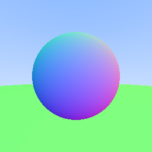
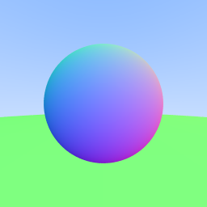

# nazoru

&mdash; Experimental raytracer in Rust &mdash;

Adapted from [Ray Tracing in One Weekend](https://raytracing.github.io/books/RayTracingInOneWeekend.html)!

## Images

*1. blue skies*

*2. heaven, earth, and a sphere*

*3. antialiasing*